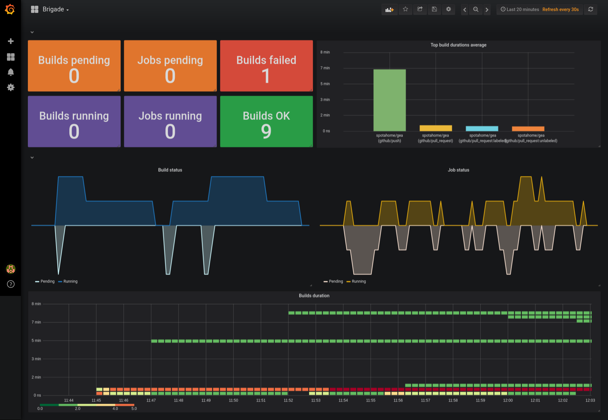

# brigade-exporter

brigade-exporter is a Prometheus metrics exporter for [Brigade].

This exporter is designed to be run along with a brigade installation, if you have multiple brigades you will have multiple brigade-exporters, one per brigade installation. This follows the philosophy of prometheus exporters of one exporter per app instance.

## Run

There is already a docker image ready to run the exporter in `slok/brigade-exporter`. It has different options to run.

### Run outside the cluster

If you want to test the exporter outside the cluster in a brigade installation, you can use `--development` flag. You will need kubectl configuration and the context set pointing to the desired cluster.

```bash
docker run --rm -it -p 9480:9480 slok/brigade-exporter \
    --debug \
    --development \
    --namespace ${MY_BRIGADE_NAMESPACE}
```

go to http://127.0.0.1:9480/metrics

## Example dashboard



## Deployment

TODO

### RBAC

TODO

## Metrics

### Exporter metrics

| Metric                                      | Type  | Meaning                            | Labels    |
| ------------------------------------------- | ----- | ---------------------------------- | --------- |
| brigade_exporter_collector_success          | gauge | Whether a collector succeeded      | collector |
| brigade_exporter_collector_duration_seconds | gauge | Collector time duration in seconds | collector |

### Project metrics

| Metric               | Type  | Meaning                     | Labels                                  |
| -------------------- | ----- | --------------------------- | --------------------------------------- |
| brigade_project_info | gauge | Brigade project information | id, name, namespace, repository, worker |

### Build metrics

| Metric                         | Type  | Meaning                           | Labels                                        |
| ------------------------------ | ----- | --------------------------------- | --------------------------------------------- |
| brigade_build_info             | gauge | Brigade build information         | id, project_id, event_type, provider, version |
| brigade_build_status           | gauge | Brigade build status              | id, status                                    |
| brigade_build_duration_seconds | gauge | Brigade build duration in seconds | id                                            |

### Job metrics

| Metric                          | Type  | Meaning                                     | Labels                    |
| ------------------------------- | ----- | ------------------------------------------- | ------------------------- |
| brigade_job_info                | gauge | Brigade job information                     | id, build_id, image, name |
| brigade_job_status              | gauge | Brigade job status                          | id, status                |
| brigade_job_duration_seconds    | gauge | Brigade job duration in seconds             | id                        |
| brigade_job_create_time_seconds | gauge | Brigade job creation time in unix timestamp | id                        |
| brigade_job_start_time_seconds  | gauge | Brigade job start time in unix timestamp    | id                        |

### Disabling metrics

You can disable metrics using flags.

- `--disable-project-collector`: Disables all the metrics of projects.
- `--disable-build-collector`: Disables all the metircs of builds.
- `--disable-job-collector`: Disables all the jobs metrics. If you have lots of jobs, this could improve the gathering and storage of metrics.

## Build from source

You can build your own brigade-exporter from source using:

```bash
make build-binary
```

to build the binary or

```bash
make build-image
```

to build the image.

## Development

### Run in fake mode

If you are developing, the exporter can fake a brigade installation and return fake data using `--fake` flag.

### Run the stack with a configured Prometheus

If you want to run a local exporter+prometheus stack run.

```bash
make stack
```

And you will have a prometheus on http://127.0.0.1:9090 that will scrape a faked brigade-exporter.

## Query examples

% of running builds per provider.

```text
sum(
    brigade_build_status{status="Running"} * on(id) group_right brigade_build_info
) by (provider)
/ on() group_left
sum(
    brigade_build_status{status="Running"})
* 100
```

Get the jobs and their states of a build

```text
brigade_job_info{build_id="build-xxxx"}
*on(id) group_right brigade_job_status
```

Get how long the jobs have been in pending state before started to run.

```text
(brigade_job_start_time_seconds > 0) - (brigade_job_create_time_seconds > 0)
```

Get the top 10 project builds duration by event and provider (in the last 30m)

```text
topk(10,
  avg(
    max_over_time(brigade_build_duration_seconds[30m])
      * on(id) group_right brigade_build_info
    * on(project_id) group_left(name)
      label_replace(brigade_project_info , "project_id", "$1", "id", "(.*)")
  ) by(name, provider, event_type))
```

Average job duration seconds per project
**Note This is an extreme example of how you owuld scalate IDs in metrics. This is not recommended.**

```text
avg(
label_replace(
    label_replace(
      avg(
        (brigade_job_duration_seconds > 0) * on(id) group_right brigade_job_info
      ) by (build_id)
    , "id", "$1", "build_id", "(.*)")
    * on(id) group_right brigade_build_info
, "id", "$1", "project_id", "(.*)")
) by (id)
* on(id) group_right brigade_project_info
```

[brigade]: https://brigade.sh
